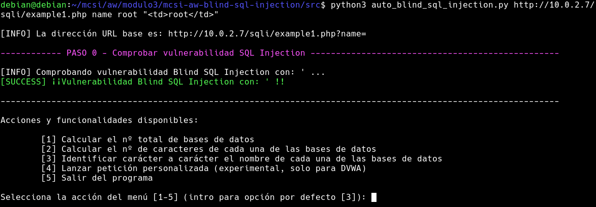

## DVWA & Web For Pentester - Auto Blind SQL Injection

### Información del proyecto
Autor: Miguel de la Cal Bravo

Asignatura: Auditoría Web - Módulo 3: Vulnerabilidades en la parte servidor

Universidad de Castilla-La Mancha (UCLM) - Máster en Ciberseguridad y Seguridad de la Información

### Estructura del repositorio
El repositorio se encuentra dividido en los siguientes directorios:
- **doc/**: carpeta de la memoria de la práctica realizada.
- **img/**: carpeta de imágenes utilizadas en la memoria.
- **src/**: carpeta donde se encuentra el script *auto_blind_sql_injection.py*.

### Descarga del repositorio
Para descargar este repositorio, ejecutaremos los siguientes comandos:
```
$ git clone https://github.com/mdelacal/mcsi-aw-blind-sql-injection.git
$ cd mcsi-aw-blind-sql-injection
```

Finalmente, nos ubicaremos en la carpeta src/ donde se encuentra el script a ejecutar:
```
$ cd src
```

### 0. Paquetes necesarios y entorno de pruebas
Primero instalamos los paquetes necesarios con *pip3* de forma automatizada mediante el fichero *requirements.txt*:
```
$ pip3 install -r requirements.txt
```

Este script ha sido diseñado para ser ejecutado contra la aplicación **DVWA** (nivel de seguridad *low*) y **Web For Pentester** (ejercicio 1) para ataques de **SQL Injection** y **Blind SQL Injection**.

*NOTA: Este script ha sido ejecutado en una máquina Debian 10 con Python 3.7.3*

Antes de ejecutar el script, nos aseguraremos de establecer el nivel de seguridad de la aplicación DVWA en *low*.


### 1. Ejecución por línea de comandos
Para ejecutar el script, introduciremos el siguiente comando por la línea de comandos:
```
$ python3 auto_blind_sql_injection.py <URL> <PARAMETER> <PARAMETER_VALUE> <EXPECTED_TRUE_OUTPUT> <PHPSESSID>
```
1. **URL**: la dirección url base sin el parámetro GET.
2. **PARAMETER**: el parámetro que pasaremos por GET en las consultas para realizar las pruebas de SQL Injection.
3. **PARAMETER_VALUE**: el valor del parámetro anterior para completar la consulta en la url base.
4. **EXPECTED_TRUE_OUTPUT**: la salida esperada al realizar una consulta verdadera.
5. **PHPSESSID**: al hacer uso de DVWA es necesario añadir este valor en las cookies, ya que se requiere una cookie de sesión.


Un ejemplo del comando a ejecutar sería el siguiente, con el parámetro id=1 y valor esperado "First name: admin":
```
$ python3 auto_blind_sql_injection.py http://<IP_ADDRESS>/dvwa/vulnerabilities/sqli_blind/ id 1 "First name: admin" <PHPSESSID>
```


Otro ejemplo podría ser con el parámetro id=2 y valor esperado "First name: Gordon":
```
$ python3 auto_blind_sql_injection.py http://<IP_ADDRESS>/dvwa/vulnerabilities/sqli_blind/ id 2 "First name: Gordon" <PHPSESSID>
```

Si queremos probar el script sobre la aplicación de Web For Pentester para el ejercicio 1, con el parámetro name=root y valor correcto esperado "\<td>root\</td>":
```
$ python3 auto_blind_sql_injection.py http://<IP_ADDRESS>/dvwa/vulnerabilities/sqli_blind/ name root "<td>root</td>"
```



*¡IMPORTANTE!: Es conveniente añadir las comillas dobles en el parámetro EXPECTED_TRUE_OUTPUT para evitar problemas con la cadena de texto esperada para comprobar.* 

### 2. Menú del script
Una vez ejecutado el script, se realizarán unas comprobaciones iniciales para comprobar si la URL es vulnerable introduciendo comillas simples ('), comillas dobles (") o ningún carácter.

Tenemos las siguientes opciones dentro del menú:
- **[1] Calcular el nº total de bases de datos**
- **[2] Calcular el nº de caracteres de cada una de las bases de datos**
- **[3] Identificar carácter a carácter el nombre de cada una de las bases de datos**
- *[4] Lanzar petición personalizada (experimental, solo para DVWA)*
- [5] Salir del programa

Si se pulsa el botón intro, se activará la opción 3 por defecto, la cual realiza el proceso completo de Blind SQL Injection para idenficar el número total de bases de datos y extracción de los nombres de cada una de las bases de datos.

### 3. Ejemplos de capturas de pantalla de uso del script

#### 3.1 DVWA
*Ejecución del paso 1: calcular el nº total de bases de datos:*


*Ejecución del paso 2: calcular el nº de caracteres de cada una de las bases de datos:*


*Ejecución del paso 3: identificar carácter a carácter el nombre de cada una de las bases de datos:*


*Ejecución de la acción 4: lanzar petición personalizada, obteniendo el usuario y base de datos utilizados por la base de datos de la aplicación DVWA:*


#### 3.2 Web For Pentester
*Ejecución completa del proceso de blind SQL Injection, pulsando intro para la realizar la acción número 3:*

